# Trabajo Práctico nº 1

# Laboratorio 4 - Universidad Blas Pascal

## Ferreyra Tomás - Año 2020

----------------------------------------------

## Ejercicios

### Ejercicio 1 - Instalar Git
#### Consignas:
* Bajar e instalar el cliente git.
    $ sudo apt install git
* Bajar e instalar un cliente visual. Se puede utilizar el cliente del IDE que utiliza normalmente (vscode, por ejemplo).
    Lista completa: https://git-scm.com/downloads/guis/

#### Resolución
	
Aplicación Gráfica elegida: **_GitKraken_**
	

### Ejercicio 2 - Crear un repositorio local y agregar archivos
#### Consignas:
* Crear un repositorio local en un nuevo directorio.
* Agregar un archivo Readme.md, que contenga tu nombre y un link a tu CV. Tu cv será otro archivo en el mismo formato, en la misma carpeta.
	Aclaración: No pongas información personal como DNI, email o telefono en tu cv, puede tener información Falsa si lo prefieren.
* Crear los commits de cada caso y proveer mensajes descriptivos.

#### Resolución:

Creación de Currículum Vitae
	
[* Currículum Vitae](CV.md)

Passos iniciales de repositorio git local
		

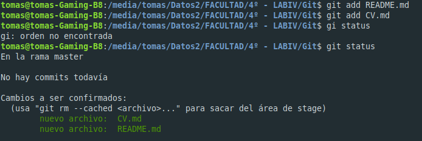
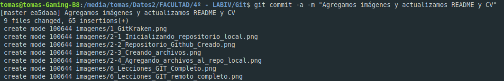
	
### Ejercicio 3 - Crear un repositorio remoto
#### Consignas:
* Crear una cuenta en https://github.com
* Crear un nuevo repositorio en dicha página (vacío)
* Asociar el repositorio local creado en el punto 2 al creado en github.
* Subir los cambios locales a github.

#### Resolución:

Creación de cuenta en GitHub.com
	
[Cuenta GitHub: Tomas Ferreyra](https://github.com/tomaslicenciado)
	
Creación de repositorio
	
[Repositorio: LAB4-TP1](https://github.com/tomaslicenciado/LAB4-TP1)
	
Asociar Repositorio Remoto
	

	
Subir Cambios Locales a Reposiorio Remoto
	

### Ejercicio 4 - Familiarizarse con el concepto de Pull Request
#### Consignas:
* Crear un branch local y agregar cambios a dicho branch.
    El cambio debe ser un archivo md donde se explique que es un pull request y un link a éste en el readme.
* Subir el cambio a dicho branch y crear un pull request.
* Completar el proceso de revisión en github y mergear el PR al branch master.

#### Resolución:

Proceso de Pull Request

Creamos la nueva rama *branchpr*

Creamos el archivo **[PullRequest.md](pull_request/PullRequest.md)**

Realizamos un push al origen remoto con los cambios aplicados

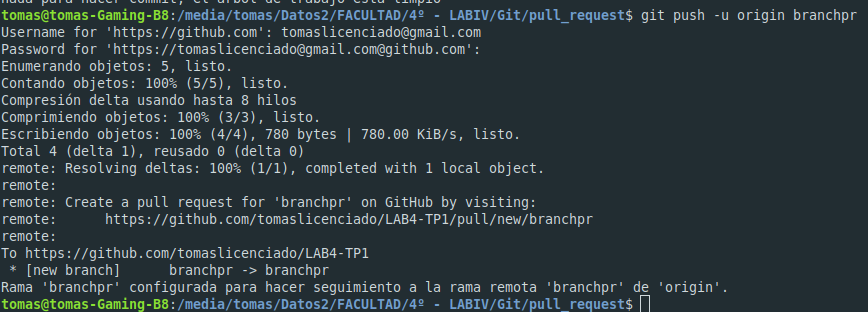

###### Paso a paso de Pull Request en GitHub:

1 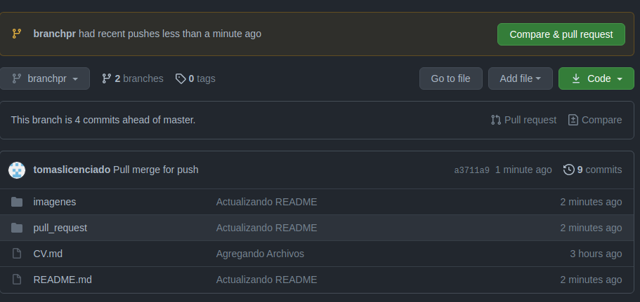

2 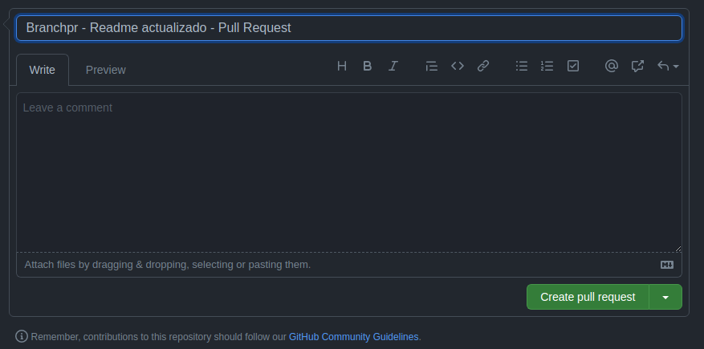

3 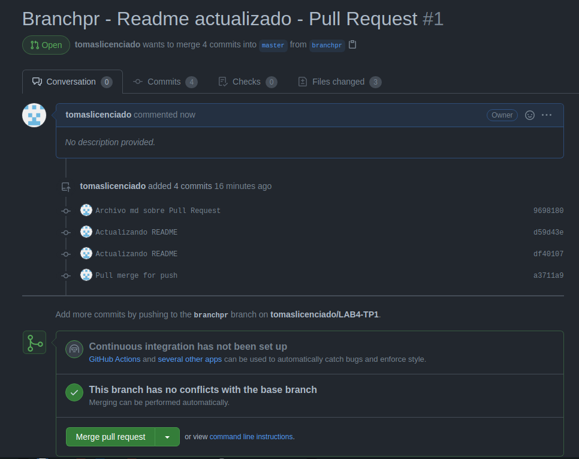

4 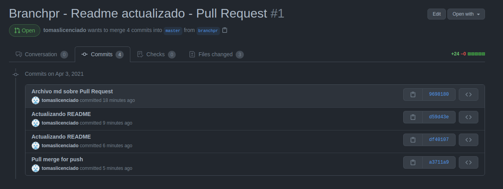

5 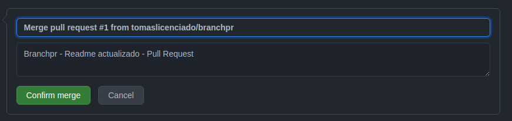

6 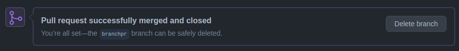

7 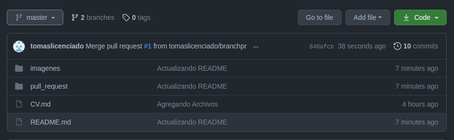

### Ejercicio 5 - Mergear código con conflictos
#### Consignas:
* Instalar alguna herramienta de comparación
    Ejemplos: SmartGit, GitEye, plugin para vscode. pycharm, etc
* Clonar en un segundo directorio de tu equipo el repositorio creado en github.
* En el clon inicial, modificar el CV.md cambiando algunas lineas.
* Hacer commit y subir el cambio a master a github.
* En el segundo clon también realizar cambios en las mismas líneas que se modificaron en el otro directorio.
* Intentar subir el cambio, haciendo un commit y push. Mostrar el error que se obtiene.
* Hacer pull y mergear el código (solo texto por ahora), mostrar la herramienta de mergeo como luce.
* Resolver los conflictos del código.
* Explicar las versiones LOCAL, BASE y REMOTE.
* Pushear el cambio mergeado.

#### Resolución:

* Herramienta utilizada: GitKraken

1 Repositorio Clonado

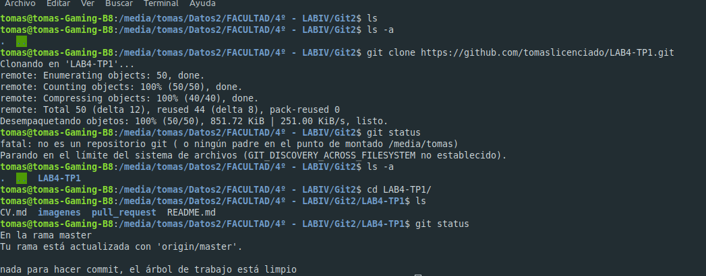

2 Modificación de archivo CV.md

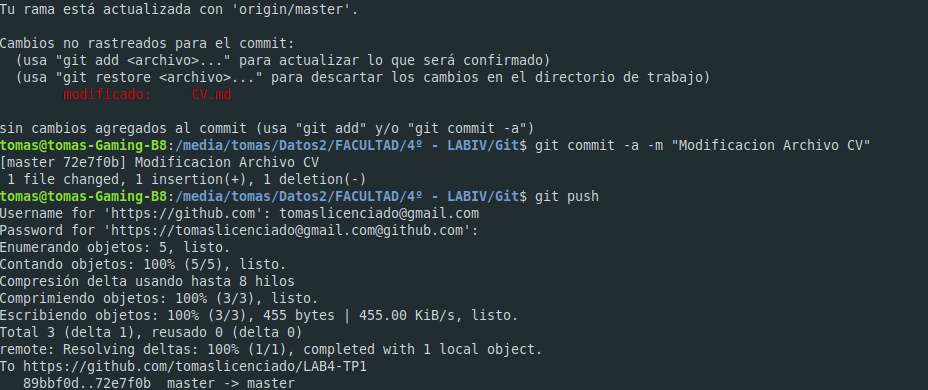

3 Se realiza commit en repositorio original y se realiza un push al repositorio remoto

4 Se realiza modificación del mismo archivo en reposiotiro clonado. Se realiza un commit y se intenta realizar un push. Mostramos error de conflictos

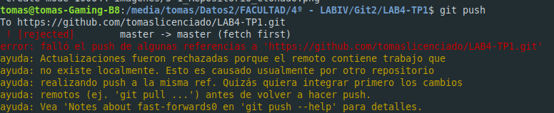

5 Recurrimos a GitKraken para visualización de conflictos

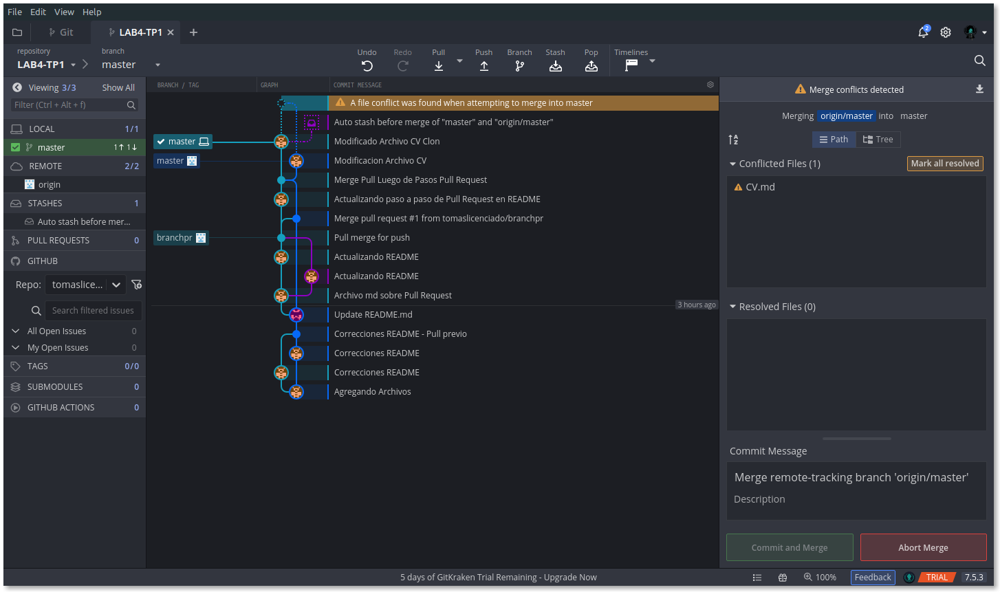

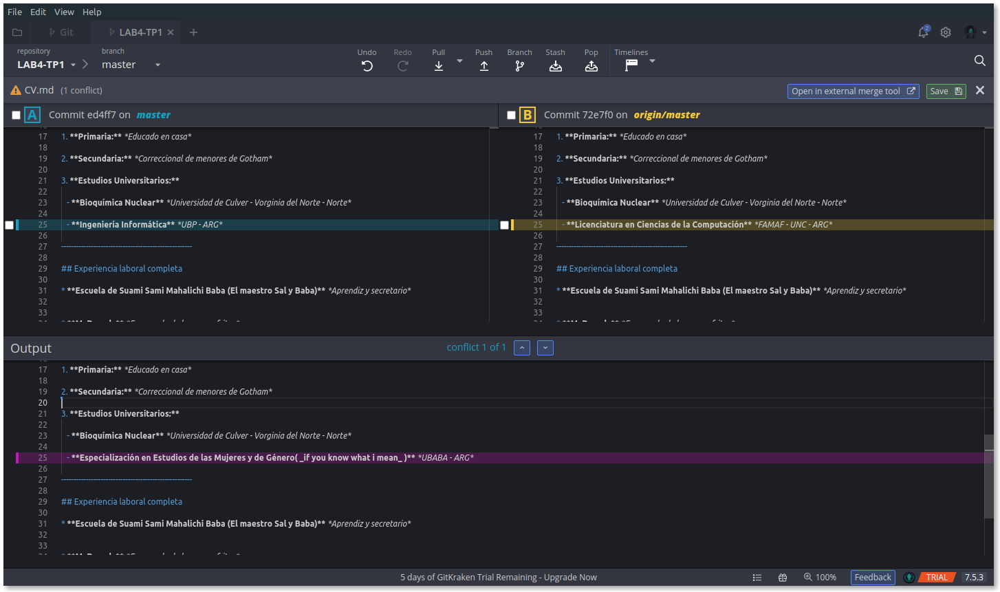

6 Conceptos básicos de Archivos Locales, Base y Remotos

* [Archivo Local, Base y Remoto](lbr/LocalBaseRemoto.md)

7 Resolución de conflictos y merge

[Volver](https://github.com/tomaslicenciado/LAB4-TP1)
