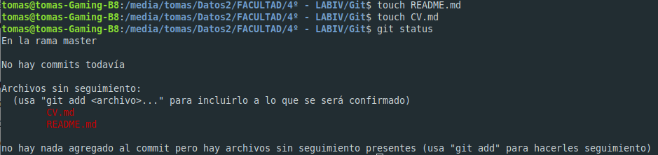

# Trabajo Práctico nº 1

# Laboratorio 4 - Universidad Blas Pascal

## Ferreyra Tomás - Año 2020

----------------------------------------------

## Ejercicios

### Ejercicio 1
	
Aplicación Gráfica elegida: **_GitKraken_**
	

### Ejercicio 2

Creación de Currículum Vitae
	
[* Currículum Vitae](CV.md)

Passos iniciales de repositorio git local
		

	
### Ejercicio 3

Creación de cuenta en GitHub.com
	
[Cuenta GitHub: Tomas Ferreyra](https://github.com/tomaslicenciado)
	
Creación de repositorio
	
[Repositorio: LAB4-TP1](https://github.com/tomaslicenciado/LAB4-TP1)
	
Asociar Repositorio Remoto
	

	
Subir Cambios Locales a Reposiorio Remoto
	

